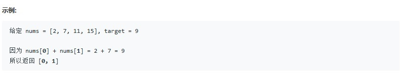

# 题目
给定一个整数数组 nums 和一个目标值 target，请你在该数组中找出和为目标值的那 两个 整数，并返回他们的数组下标。

```C++
class Solution {
public:
    vector<int> twoSum(vector<int>& nums, int target) {
        unordered_map<int,int> tmp;
        for(int n =0;n!=nums.size();++n)
        {
            if(tmp.find(target-nums[n])!=tmp.end())
            {
                return {tmp[target-nums[n]],n};
            }
            tmp[nums[n]]=n;
        }
        return {};
    }
};
```