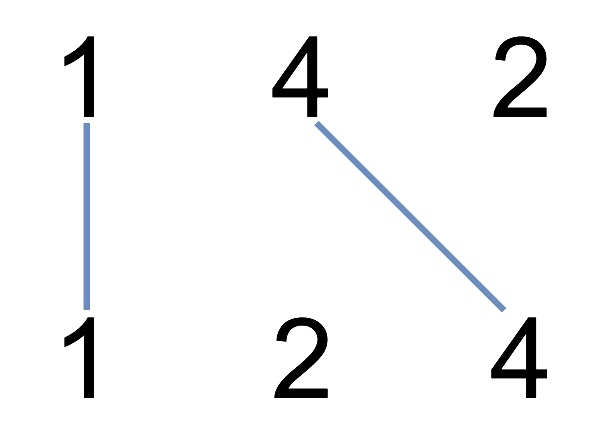

# 题目
我们在两条独立的水平线上按给定的顺序写下 A 和 B 中的整数。

现在，我们可以绘制一些连接两个数字 A[i] 和 B[j] 的直线，只要 A[i] == B[j]，且我们绘制的直线不与任何其他连线（非水平线）相交。

以这种方法绘制线条，并返回我们可以绘制的最大连线数。


* 示例：

>输入：A = [1,4,2], B = [1,2,4]<br>
输出：2<br>
解释：<br>
我们可以画出两条不交叉的线，如上图所示。<br>
我们无法画出第三条不相交的直线，因为从 A[1]=4 到 B[2]=4 的直线将与从 A[2]=2 到 B[1]=2 的直线相交。


* 思路：问题等价于求两个数组的最长公共序列。c[i,j]表示X<sub>i</sub>和Y<sub>j</sub>的LCS的长度。
    1. c[i,j]=0,如果i==0或j==0
    2. c[i,j]=c[i-1][j-1]+1,如果i,j>0,且x<sub>i</sub>==y<sub>j</sub>
    3. c[i,j]=max(c[i-1][j],c[i][j-1])

* 代码：
    ```C++
    class Solution {
    public:
        int maxUncrossedLines(vector<int>& A, vector<int>& B) {
            int lengthA = A.size();
            int lengthB = B.size();
            vector<vector<int>> dp(lengthA+1,vector<int>(lengthB+1,0));
            for(int n=1;n<=lengthA;++n)
            {
                for(int m=1;m<=lengthB;++m)
                {
                    if(A[n-1]==B[m-1])
                    {
                        dp[n][m]=dp[n-1][m-1]+1;
                    }
                    else if(dp[n-1][m]>dp[n][m-1])
                    {
                        dp[n][m]=dp[n-1][m];
                    }
                    else
                    {
                        dp[n][m]=dp[n][m-1];
                    }
                }
            }
            return dp[lengthA][lengthB];
        }
    };
    ```