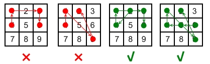

# 题目
我们都知道安卓有个手势解锁的界面，是一个 3 x 3 的点所绘制出来的网格。

给你两个整数，分别为 ​​m 和 n，其中 1 ≤ m ≤ n ≤ 9，那么请你统计一下有多少种解锁手势，是至少需要经过 m 个点，但是最多经过不超过 n 个点的。

 

先来了解下什么是一个有效的安卓解锁手势:

    每一个解锁手势必须至少经过 m 个点、最多经过 n 个点。
    解锁手势里不能设置经过重复的点。
    假如手势中有两个点是顺序经过的，那么这两个点的手势轨迹之间是绝对不能跨过任何未被经过的点。
    经过点的顺序不同则表示为不同的解锁手势。



解释:
||||
|:--|:--|:--|
| 1 | 2 | 3 |
| 4 | 5 | 6 |
| 7 | 8 | 9 |

无效手势：4 - 1 - 3 - 6
连接点 1 和点 3 时经过了未被连接过的 2 号点。

无效手势：4 - 1 - 9 - 2
连接点 1 和点 9 时经过了未被连接过的 5 号点。

有效手势：2 - 4 - 1 - 3 - 6
连接点 1 和点 3 是有效的，因为虽然它经过了点 2 ，但是点 2 在该手势中之前已经被连过了。

有效手势：6 - 5 - 4 - 1 - 9 - 2
连接点 1 和点 9 是有效的，因为虽然它经过了按键 5 ，但是点 5 在该手势中之前已经被连过了。

* 思路：将9个点看做互相连通的一个图，类似图的深度优先搜索，但是这个搜索是有附件条件的，第一、不能下一个搜索点不能和当前点产生跨越，第二搜索的深度是指定的
    1. 先用一个数组记录所有产生跨越的组合
    2. visited记录点是否已被访问
    3. 由于1，3，7，9对称，因此只需要计算一次乘以4
    4. 2，4，6，8对称，因此只需要计算一次乘以4
    5. 5单独计算


* 代码：
    ```C++
    class Solution {
    public:
        int numberOfPatterns(int m, int n) {
            vector<vector<int>> cross(10,vector<int>(10,0));
            cross[1][3] = cross[3][1] = 2;
            cross[4][6] = cross[6][4] = 5;
            cross[7][9] = cross[9][7] = 8;
            cross[1][7] = cross[7][1] = 4;
            cross[2][8] = cross[8][2] = 5;
            cross[3][9] = cross[9][3] = 6;
            cross[1][9] = cross[9][1] = 5;
            cross[3][7] = cross[7][3] = 5;
            vector<bool> visited(10,false);
            int result=0;
            for(int i=m;i<=n;++i)
            {
                result += DFS(1,cross,visited,i-1)*4;
                result += DFS(2,cross,visited,i-1)*4;
                result += DFS(5,cross,visited,i-1);
            }
            return result;
        }

        int DFS(int cur,vector<vector<int>>& cross,vector<bool>& visited,int remained)
        {
            if(remained==0)
            {
                return 1;
            }
            int result = 0;
            visited[cur] = true;
            for(int k=1;k<10;++k)
            {
                if(!visited[k]&&(!cross[cur][k]||visited[cross[cur][k]]))
                {
                    result += DFS(k,cross,visited,remained-1);
                }
            }
            visited[cur]=false;
            return result;
        }
    };
    ```