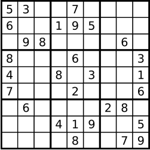
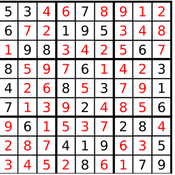

# 题目
编写一个程序，通过已填充的空格来解决数独问题。

一个数独的解法需遵循如下规则：

    数字 1-9 在每一行只能出现一次。
    数字 1-9 在每一列只能出现一次。
    数字 1-9 在每一个以粗实线分隔的 3x3 宫内只能出现一次。

空白格用 '.' 表示。

* 示例：






Note:

    给定的数独序列只包含数字 1-9 和字符 '.' 。
    你可以假设给定的数独只有唯一解。
    给定数独永远是 9x9 形式的。

* 思路：深搜判断是否满足条件，重点在于如何减少时间复杂度，避免超时，使用三个数组分别记录当前数组在一行，一列，一块中是否出现过，避免每次check，另外记录所有需要填写数字的位置，避免遍历board查找需要填写数字的位置

* 代码：
    ```C++
    class Solution
    {
    public:
        vector<vector<bool>> rowflag;
        vector<vector<bool>> colflag;
        vector<vector<bool>> blockflag;
        vector<pair<int, int>> pos;
        bool DFS(vector<vector<char>> &board, int count)
        {
            if (count == pos.size())
            {
                return true;
            }
            auto nowpos = pos[count];
            int r = nowpos.first;
            int c = nowpos.second;
            for (int attempt = 1; attempt < 10; ++attempt)
            {
                if (!rowflag[r][attempt - 1] && !colflag[c][attempt - 1] && !blockflag[r / 3 * 3 + c / 3][attempt - 1])
                {
                    rowflag[r][attempt - 1] = true;
                    colflag[c][attempt - 1] = true;
                    blockflag[r / 3 * 3 + c / 3][attempt - 1] = true;
                    board[r][c] = '0' + attempt;
                    if (DFS(board,count + 1))
                    {
                        return true;
                    }
                    board[r][c] = '.';
                    rowflag[r][attempt - 1] = false;
                    colflag[c][attempt - 1] = false;
                    blockflag[r / 3 * 3 + c / 3][attempt - 1] = false;
                }
            }

            return false;
        }
        void solveSudoku(vector<vector<char>> &board)
        {
            int row = 9;
            int col = 9;
            int target = 0;
            rowflag = vector<vector<bool>>(9, vector<bool>(9, false));
            colflag = vector<vector<bool>>(9, vector<bool>(9, false));
            blockflag = vector<vector<bool>>(9, vector<bool>(9, false));
            for (int r = 0; r < row; ++r)
            {
                for (int c = 0; c < col; ++c)
                {
                    if (board[r][c] == '.')
                    {
                        pos.push_back({r, c});
                    }
                    else
                    {
                        rowflag[r][board[r][c] - '0' - 1] = true;
                        colflag[c][board[r][c] - '0' - 1] = true;
                        blockflag[r / 3 * 3 + c / 3][board[r][c] - '0' - 1] = true;
                    }
                }
            }
            DFS(board, 0);

            return;
        }
    };
    ```
